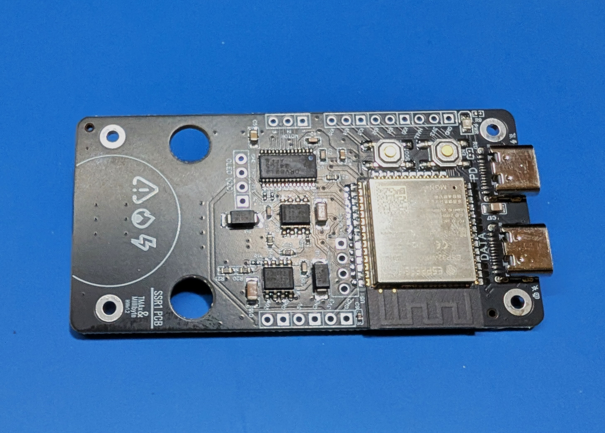
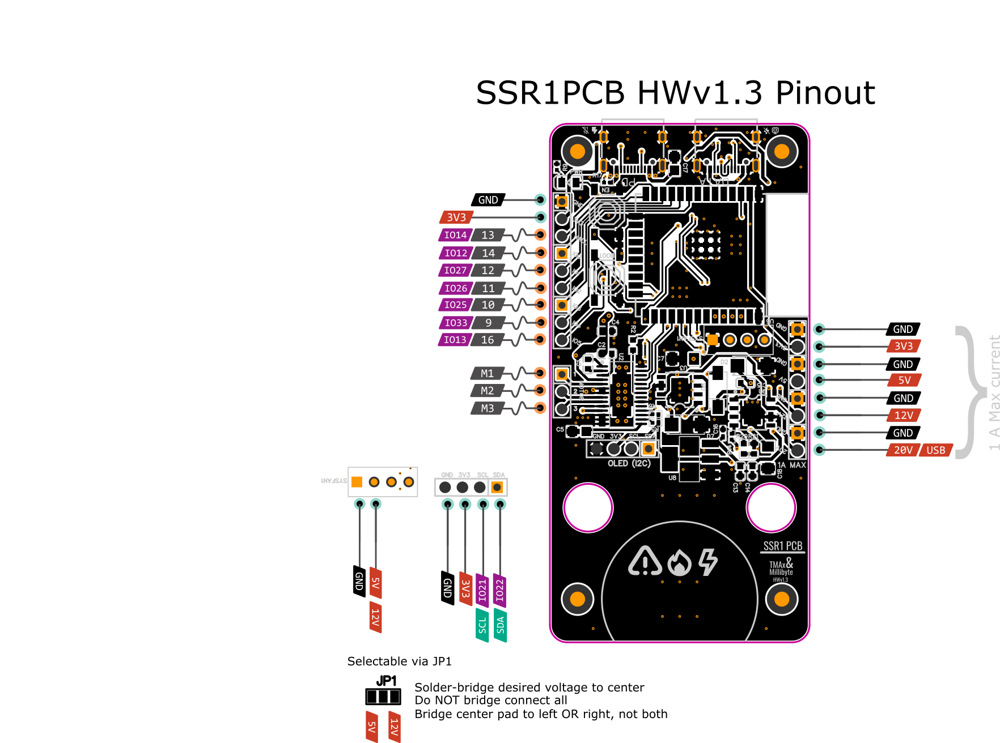

# SSR1PCB
An ESP32 Motor Control board for the TMAx SR1.
Integrates USB Power Delivery at 100W (use appropriate cabling)

:warning: **This device can use dangerous amounts of power**: Device may become very hot in use and may present a fire hazard. Operate at own risk.
Device can draw up to 100W from a compatible power supply. Ensure all cabling and any power devices are rated for this much power dissipation.
Device may present a shock hazard.

## Hardware V1.3

### USB PD
USB power delivery port can sink up to 5A at 20V, meeting the maximum 100W usb-c PD standard.
A cable rated for 100W draw should be used. A power supply rated for 100W draw should be used.
Device does not operate as a source.
### USB Data
A second usb port is used for data and low voltage programming.
When using this port without the PD port, any motors or other high draw loads should be disconnected from the board.
PD operation will energize the 5V power domain.
### External power
The power regulators are exposed through user accessable pins.
A 12V, 5V, 3.3V and PD rail (20v) are exposed.
20V total draw should not exceed 5A. Note that pin headers may not be rated for more than 1A draw. 20V connections should not draw more than 1A.
12V total draw should not exceed 3A. Not that pin headers may not be rated for more than 1A draw, 12V connections should not draw more than 1A.
5V total draw should not exceed 1A. Note that pin headers may not be rated for more than 1A draw. 5V connections should not draw more than 1A.
3.3V total draw should not exceed 1A. Note that pin headers may not be rated for more than 1A draw. 3.3V connections should not draw more than 500mA.
Using the 3.3V power rail may adversely effect the operation of the ESP32.

## Pinout

1) ESP32 uses multiplexed peripherals, hardware assignments are recomended
2) SPI (vspi) Pins required to access encoder

| Pin | Arduino GPIO | Function/Description |
| --- | ------------ | -------------------- |
|   9 |       GPIO33 | User IO 4            |
|  10 |       GPIO25 | User IO 3            |
|  11 |       GPIO26 | User IO 2            |
|  12 |       GPIO27 | User IO 1            |
|  13 |       GPIO14 | User / Hall Effect   |
|  14 |       GPIO12 | User IO 0            |
|  13 |       GPIO13 | User IO 5            |
|  23 |       GPIO15 | FOC N_FAULT          |
|  24 |        GPIO2 | FOC IN1              |
|  25 |         BOOT | BOOT                 |
|  26 |        GPIO4 | FOC Enable           |
|  27 |       GPIO16 | FOC IN2              |
|  28 |       GPIO17 | FOC IN3              |
|  29 |        GPIO5 | SSI/SPI CS           |
|  30 |       GPIO18 | SSI/SPI CLK          |
|  31 |       GPIO19 | SSI DATA/SPI MISO    |
|  33 |       GPIO21 | I2C SCL              |
|  34 |       RXD0   | UART (usb reserved)  |
|  35 |       TXD0   | UART (usb reserved)  |
|  36 |       GPIO22 | I2C SDA              |
| --- | ------------ | -------------------- |

## Peripherals
Onboard peripherals include 
* MT6701QT-STD rotary encoder in SSI mode
* DRV8313PWPR FOC controller
* CP2102-GMR USB-UART transcoder/controller

## Software
See  folder for basic TCode implementation.
Built with Platformio.

### Troubleshooting/FAQ
:My motor wont spin:
Check that the 20V rail is powered (USB PC) with a source that is 100W certified.
Ensure cable used is 100W certified.
:My motor wont spin/vibrates:
Check that you have not screwed too far into the motor and damaged the coils.
Replace motor if so.
:My motor spins initially, then just vibrates:
Check encoder magnet orientation. Incorrect orientation will cause unpredictable motor behavior. N/S poles must be orthogonal to encoder.
